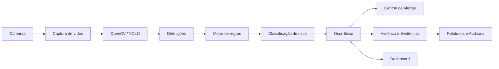

# SafeVision AI

### Plataforma Inteligente de Segurança Proativa Industrial
**Challenge 2026 — FIAP × SPI Integrações | Engenharia de Software**

> Sistema voltado ao contexto da **Metaindústria**, utilizando Inteligência Artificial e Visão Computacional para apoiar o monitoramento de segurança, identificação de não conformidades relacionadas a EPIs, geração de alertas, rastreabilidade de ocorrências e análise de indicadores operacionais.

---

##  Equipe — SecurIT

| Integrante | RM |
|---|---|
| Ana Luiza Oliveira Dourado | RM558793 |
| Carlos Augusto da Cruz Possi | RM558758 |
| Fabio Henrique Santos Faria | RM552453 |
| João Pedro Bernardes Santos da Silva | RM557142 |
| Leonardo Tanaka Cortez | RM556781 |

**Curso:** Engenharia da Computação — FIAP  
**Disciplina:** Engenharia de Software  
**Professor:** Hercules Lima Ramos  
**Sprint:** 3 — Entrega final  
**Data de consolidação:** 17/09/2026

---

# Acesso rápido

| Artefato | Link |
|---|---|
| 💻 Repositório principal | https://github.com/An4lu/SPRINT_EngenhariadeSoftware/tree/main |
| 🚀 Repositório do MVP | https://github.com/An4lu/SPRINT-2---Engenharia-de-Software---MVP |
| 🌐 MVP publicado | https://sprint-2-engenharia-de-software-mvp.vercel.app/ |
| 🎨 Protótipo no Figma | https://www.figma.com/design/T2jxOiZXGaYVfIhwDWxHow/Untitled?node-id=0-1&t=P6XGKeJassPzaVH9-1 |
| 📋 Board Scrum no Trello | https://trello.com/invite/b/6aac1cecb319ca9d264a4c5c/ATTI94a07ec8bc406fdfd9dd236a8e21a302901D4E56/securit |
| 📄 Documento acadêmico | `docs/sprint-3/SafeVision_AI_Sprint3_Documento_Final.docx` |

> **Importante:** o protótipo permaneceu no mesmo arquivo do Figma durante a Sprint 3. A evolução ocorreu de maneira incremental, mantendo o histórico e a rastreabilidade do projeto.

---

# 📌 Sobre o projeto

Ambientes industriais exigem acompanhamento constante das condições de segurança. A conferência exclusivamente manual de EPIs e situações de risco pode dificultar a identificação imediata de não conformidades, especialmente em ambientes com múltiplas câmeras, setores e eventos simultâneos.

O **SafeVision AI** foi concebido como uma plataforma de apoio à segurança industrial. A solução propõe integrar câmeras de monitoramento, processamento de imagens, Inteligência Artificial, regras de negócio e uma interface centralizada para transformar imagens do ambiente em informações operacionais.

A proposta não se limita à detecção. O sistema organiza o ciclo completo da informação:

```text
Captura → Detecção → Interpretação → Classificação → Alerta
        → Evidência → Histórico → Indicadores → Auditoria
```

Dessa forma, o SafeVision AI fornece uma visão integrada das ocorrências e permite que usuários autorizados acompanhem o ambiente, consultem evidências, analisem indicadores e gerenciem recursos relacionados ao monitoramento.

---

# Objetivos

## Objetivo geral

Desenvolver uma solução capaz de utilizar Visão Computacional e uma plataforma web para apoiar a identificação, registro e acompanhamento de situações relacionadas à segurança em ambientes industriais.

## Objetivos específicos

- apoiar a identificação de ausência ou uso inadequado de EPIs;
- centralizar informações provenientes do monitoramento;
- classificar eventos de acordo com sua relevância e criticidade;
- disponibilizar alertas para acompanhamento operacional;
- armazenar ocorrências e evidências para consulta posterior;
- fornecer indicadores de segurança em dashboard;
- permitir análise histórica e auditoria;
- representar e acompanhar as câmeras utilizadas no monitoramento;
- controlar usuários e níveis de acesso;
- estruturar uma arquitetura preparada para comunicação em tempo real;
- manter rastreabilidade entre requisitos, protótipo, desenvolvimento e gestão Scrum.

---

# Principais módulos

## Monitoramento

Área operacional destinada à visualização das câmeras e das informações produzidas pelo processamento das imagens.

O módulo representa o ponto central de acompanhamento do ambiente e se relaciona diretamente com detecções, alertas e ocorrências.

## Central de Alertas

Concentra eventos identificados pelo sistema e facilita a visualização de situações que demandam atenção.

Os refinamentos realizados buscaram destacar criticidade, contexto e hierarquia das informações.

## Dashboard Executivo

Apresenta uma visão consolidada dos principais indicadores do sistema, permitindo acompanhar tendências, ocorrências e informações relevantes de SST.

## Histórico e Evidências

Mantém a rastreabilidade das ocorrências identificadas e de suas respectivas evidências, apoiando investigação posterior e auditoria.

## Relatórios e Auditoria

Organiza informações históricas e indicadores para análise das ocorrências registradas pelo SafeVision AI.

## Inventário de Câmeras

Representa os dispositivos responsáveis pela captura das imagens e seus estados operacionais.

Esse fluxo amplia a solução para além da detecção, incluindo a gestão da infraestrutura necessária ao monitoramento.

## Gestão de Usuários e Permissões

Representa o controle administrativo da plataforma e a separação de responsabilidades entre diferentes perfis de acesso.

---

# Fluxo funcional



O processamento das imagens gera detecções que são interpretadas pelo motor de regras. A partir dessas informações, a aplicação pode estruturar ocorrências e disponibilizá-las aos diferentes módulos.

---

# Arquitetura técnica

A arquitetura foi refinada ao longo das Sprints para separar responsabilidades e facilitar a compreensão do fluxo da solução.

```text
┌─────────────────────────────┐
│     Câmeras Industriais     │
└──────────────┬──────────────┘
               ↓
┌─────────────────────────────┐
│      Captura de Vídeo       │
└──────────────┬──────────────┘
               ↓
┌─────────────────────────────┐
│      OpenCV + YOLO          │
│   Visão Computacional       │
└──────────────┬──────────────┘
               ↓
┌─────────────────────────────┐
│       Motor de Regras       │
│ Interpretação das detecções │
└──────────────┬──────────────┘
               ↓
┌─────────────────────────────┐
│   Classificação de Risco    │
└──────────────┬──────────────┘
               ↓
┌─────────────────────────────┐
│          FastAPI            │
│     Serviços / Backend      │
└──────────────┬──────────────┘
               ↓
┌─────────────────────────────┐
│         PostgreSQL          │
│ Persistência e histórico    │
└──────────────┬──────────────┘
               ↓
┌─────────────────────────────┐
│ REST API + WebSockets       │
└──────────────┬──────────────┘
               ↓
┌─────────────────────────────┐
│     React + TypeScript      │
│     Interface Web           │
└─────────────────────────────┘
```

### Camadas

**Visão Computacional** — responsável pela aquisição e análise dos frames, utilizando OpenCV e YOLO.

**Motor de Regras** — interpreta as detecções e transforma resultados técnicos em eventos compreensíveis pela aplicação.

**Backend / API** — centraliza serviços, regras da aplicação, consultas e integração entre os módulos.

**Persistência** — armazena informações necessárias para histórico, usuários, câmeras, eventos, evidências e auditoria.

**Comunicação em tempo real** — WebSockets representam o mecanismo para propagação dinâmica de eventos e alertas.

**Frontend** — disponibiliza monitoramento, dashboard, alertas, histórico, relatórios e recursos administrativos.

---

# Tecnologias e ferramentas

| Tecnologia | Utilização |
|---|---|
| Python | Processamento e serviços relacionados à IA |
| YOLO | Detecção de objetos |
| OpenCV | Captura e processamento de imagens |
| FastAPI | API e serviços backend |
| PostgreSQL | Persistência de dados |
| React | Construção da interface |
| TypeScript | Desenvolvimento frontend tipado |
| WebSockets | Comunicação e atualizações em tempo real |
| Figma | Prototipação de alta fidelidade |
| Trello | Gestão Scrum e rastreabilidade das atividades |
| GitHub | Versionamento e documentação |
| Vercel | Publicação do MVP |

---

# UX/UI e protótipo

O protótipo de alta fidelidade está disponível no Figma:

**🔗 https://www.figma.com/design/T2jxOiZXGaYVfIhwDWxHow/Untitled?node-id=0-1&t=P6XGKeJassPzaVH9-1**

A evolução da Sprint 3 foi realizada no próprio arquivo já utilizado pelo grupo. Em vez de criar uma nova versão separada, foram consolidados fluxos e aplicados refinamentos de usabilidade.

## Evoluções consolidadas

### 1. Inventário de Câmeras e Status

A solução passou a representar de maneira mais clara a infraestrutura de câmeras.

**Motivação:** o monitoramento depende diretamente da disponibilidade dos dispositivos. A visão administrativa facilita a identificação de câmeras e possíveis indisponibilidades.

### 2. Gestão de Usuários e Permissões

O fluxo administrativo foi consolidado para representar diferentes perfis e níveis de acesso.

**Motivação:** informações operacionais e administrativas precisam respeitar diferentes responsabilidades dentro da plataforma.

### 3. Histórico e Evidências

O fluxo foi refinado para favorecer rastreabilidade, consulta posterior e auditoria das ocorrências.

### 4. Dashboard, Alertas e Relatórios

Foram revisadas hierarquia visual, organização das informações e leitura de indicadores.

---

# Visita técnica e validação — 11/08/2026

A visita técnica foi utilizada como momento de observação e teste da solução em contexto mais próximo ao ambiente de aplicação.

Durante os testes foram percebidas oportunidades de melhoria relacionadas principalmente a:

- orientação das telas;
- rotação das telas;
- disposição dos componentes;
- legibilidade em diferentes posicionamentos;
- visualização rápida das informações operacionais.

Após a visita, foram realizados ajustes pontuais mantendo a identidade visual e a estrutura principal do protótipo.

Esse processo foi importante para relacionar decisões de interface com condições reais de visualização, transformando observações da validação em refinamentos do produto.

---

# Metodologia Scrum — Sprint 3

O desenvolvimento e a consolidação da Sprint 3 foram organizados utilizando Scrum.

** Board:** https://trello.com/invite/b/6aac1cecb319ca9d264a4c5c/ATTI94a07ec8bc406fdfd9dd236a8e21a302901D4E56/securit

## Estrutura do board

```text
Product Backlog
      ↓
Sprint Backlog
      ↓
Em andamento
      ↓
Em revisão
      ↓
Concluído
```

Os cards registram atividades relacionadas a desenvolvimento, UX, testes, arquitetura, documentação e cerimônias.

---

# Product Backlog

| ID | Prioridade | Funcionalidade |
|---|---|---|
| PB01 | P0 | Monitoramento em tempo real |
| PB02 | P0 | Detecção de ausência de EPI |
| PB03 | P0 | Classificação de riscos |
| PB04 | P0 | Central de alertas |
| PB05 | P0 | Dashboard executivo |
| PB06 | P1 | Histórico e evidências |
| PB07 | P1 | Relatórios e auditoria |
| PB08 | P1 | Inventário de câmeras |
| PB09 | P1 | Gestão de usuários e permissões |
| PB10 | P1 | Filtros operacionais |
| PB11 | P2 | Notificações em tempo real |
| PB12 | P2 | Exportação de relatórios |
| PB13 | P2 | Auditoria de ações |
| PB14 | P2 | Indicadores históricos |
| PB15 | P3 | Configurações administrativas avançadas |

**P0:** essencial ao núcleo da solução  
**P1:** alta importância para operação e administração  
**P2:** evolução funcional relevante  
**P3:** evolução complementar

---

# Sprint Backlog — Sprint 3

A Sprint 3 contemplou atividades agrupadas em seis frentes:

| Frente | Principais atividades |
|---|---|
| Desenvolvimento | monitoramento, dashboard, alertas, histórico, câmeras e usuários |
| UX/UI | refinamentos visuais, navegação, orientação e rotação |
| Testes | preparação, visita técnica e validação |
| Arquitetura | pipeline de IA, regras, API, persistência e comunicação |
| Scrum | backlog, DoD, Planning, Dailies e Review |
| Documentação | README, documento acadêmico e evidências |

O detalhamento completo, com responsáveis, critérios de aceite e status, encontra-se no Trello.

---

# Definition of Done — DoD

Uma atividade foi considerada concluída quando:

- os critérios de aceite foram atendidos;
- o resultado estava coerente com o contexto do SafeVision AI;
- a atividade passou por revisão quando aplicável;
- a consistência visual ou funcional foi verificada;
- alterações relevantes foram documentadas;
- o responsável estava identificado;
- o status foi atualizado no Trello;
- evidências ou resultados foram armazenados;
- o item estava apto para apresentação.

---

# Cerimônias e acompanhamento

| Data | Registro |
|---|---|
| 15/07/2026 | Sprint Planning |
| 22/07/2026 | Daily assíncrona — revisão e levantamento de melhorias |
| 05/08/2026 | Daily assíncrona — preparação para validação |
| 11/08/2026 | Visita técnica, testes e acompanhamento |
| 25/08/2026 | Daily assíncrona — revisão dos ajustes e documentação |
| 17/09/2026 | Sprint Review e consolidação da entrega |

O conteúdo detalhado das cerimônias está disponível em:

`docs/sprint-3/SafeVision_AI_Sprint3_Documento_Final.docx`

---

# Mapeamento de funcionalidades

| Necessidade | Módulo |
|---|---|
| Acompanhar ambiente industrial | Monitoramento |
| Identificar situações relacionadas a EPI | Visão Computacional |
| Priorizar ocorrências | Classificação de Risco |
| Visualizar eventos relevantes | Central de Alertas |
| Consultar indicadores | Dashboard Executivo |
| Investigar eventos anteriores | Histórico e Evidências |
| Apoiar auditoria | Relatórios e Auditoria |
| Administrar dispositivos | Inventário de Câmeras |
| Administrar acessos | Gestão de Usuários e Permissões |

---

# Organização da documentação

```text
SPRINT_EngenhariadeSoftware/
│
├── README.md
├── database/
│
└── docs/
    ├── sprint-3/
    │   ├── SafeVision_AI_Sprint3_Documento_Final.docx
    │   ├── evidencias-trello/
    │   ├── evidencias-figma/
    │   └── evidencias-visita-tecnica/
    │
    ├── levantamento-requisitos.md
    ├── personas.md
    ├── regras-de-negocio.md
    ├── arquitetura-da-solucao.md
    └── diagramas/
```

---

# Entregáveis

### Sprint 1
- levantamento e análise de requisitos;
- personas e contexto de uso;
- regras de negócio;
- modelagem e arquitetura inicial.

### Sprint 2
- evolução do produto;
- protótipo de alta fidelidade;
- MVP;
- validação dos principais fluxos.

### Sprint 3
- refinamentos do protótipo;
- novos fluxos administrativos;
- testes e visita técnica;
- Product Backlog;
- Sprint Backlog;
- Definition of Done;
- board Scrum;
- Planning;
- Dailies;
- Review;
- arquitetura refinada;
- documentação final.

---

# Documentação e evidências

Para facilitar a rastreabilidade da entrega, os artefatos ficam centralizados entre GitHub, Figma e Trello:

### Código e documentação
**https://github.com/An4lu/SPRINT_EngenhariadeSoftware/tree/main**

### MVP — repositório
**https://github.com/An4lu/SPRINT-2---Engenharia-de-Software---MVP**

### MVP — aplicação
**https://sprint-2-engenharia-de-software-mvp.vercel.app/**

### Protótipo
**https://www.figma.com/design/T2jxOiZXGaYVfIhwDWxHow/Untitled?node-id=0-1&t=P6XGKeJassPzaVH9-1**

### Gestão Scrum
**https://trello.com/invite/b/6aac1cecb319ca9d264a4c5c/ATTI94a07ec8bc406fdfd9dd236a8e21a302901D4E56/securit**

---

# Possíveis evoluções futuras

Embora o escopo acadêmico tenha sido concluído, a arquitetura permite evoluções como:

- integração mais profunda com fontes de vídeo em tempo real;
- ampliação das classes detectadas pelo modelo;
- calibração de regras por setor;
- dashboards históricos mais avançados;
- notificações externas;
- trilhas de auditoria mais detalhadas;
- métricas de desempenho do modelo;
- gestão avançada de dispositivos;
- integração com outros sistemas industriais;
- testes automatizados e observabilidade.

---

# Status final

| Etapa | Status |
|---|---|
| Sprint 1 — Engenharia e requisitos | ✅ Concluída |
| Sprint 2 — Protótipo e MVP | ✅ Concluída |
| Sprint 3 — Scrum, validação e consolidação | ✅ Concluída |
| Visita técnica / testes | ✅ Realizada |
| Documentação final | ✅ Concluída |
| Projeto acadêmico | ✅ Finalizado |

---

## Conclusão

O SafeVision AI evoluiu de uma proposta de monitoramento inteligente para uma solução estruturada que conecta **Visão Computacional, regras de negócio, gestão de ocorrências, experiência do usuário e rastreabilidade do desenvolvimento**.

Ao longo das Sprints, o grupo trabalhou requisitos, prototipação, MVP, arquitetura, testes e gestão Scrum. Na Sprint 3, a visita técnica e os refinamentos de interface aproximaram o protótipo do contexto de utilização, enquanto Product Backlog, Sprint Backlog, Definition of Done e cerimônias formalizaram o processo de Engenharia de Software.

A entrega final centraliza os artefatos técnicos, visuais e de gestão necessários para demonstrar tanto a evolução do produto quanto o processo utilizado para construí-lo.

---

### SecurIT — Engenharia da Computação | FIAP
**SafeVision AI • Challenge 2026**
