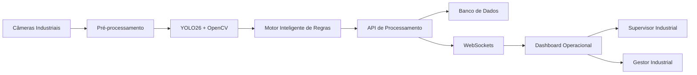

# Diagrama de Arquitetura

# Objetivo

O Diagrama de Arquitetura representa a estrutura macro da solução SafeVision AI e o fluxo de comunicação entre os componentes da plataforma.

A arquitetura foi desenvolvida considerando:

- baixa latência
- escalabilidade
- modularidade
- confiabilidade
- processamento em tempo real

---

# Diagrama Arquitetural

---

# Descrição dos Componentes

## Câmeras Industriais

Responsáveis pela captura contínua dos ambientes monitorados.

---

## Pré-processamento

Realiza tratamento computacional dos frames capturados.

---

## YOLO26 + OpenCV

Responsáveis pela inferência computacional e detecção dos elementos operacionais.

---

## Motor Inteligente de Regras

Responsável por:

- validação de conformidade
- classificação de risco
- geração de eventos críticos

---

## API de Processamento

Centraliza comunicação entre os serviços internos da solução.

---

## Banco de Dados

Responsável pela persistência histórica e rastreabilidade operacional.

---

## WebSockets

Garantem atualização em tempo real dos dashboards operacionais.

---

## Dashboard Operacional

Permite visualização estratégica e operacional das ocorrências.