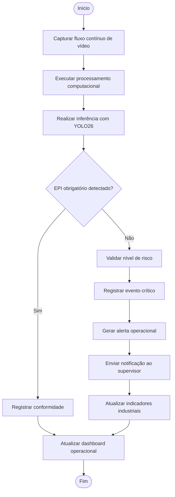

# Diagrama de Atividades

```mermaid
flowchart TD

A([Início])

B[Capturar fluxo contínuo de vídeo]
C[Executar processamento computacional]
D[Realizar inferência com YOLO26]
E{EPI obrigatório detectado?}

F[Registrar conformidade]
G[Atualizar dashboard operacional]

H[Validar nível de risco]
I[Registrar evento crítico]
J[Gerar alerta operacional]
K[Enviar notificação ao supervisor]
L[Atualizar indicadores industriais]

M([Fim])

A --> B
B --> C
C --> D
D --> E

E -- Sim --> F
F --> G
G --> M

E -- Não --> H
H --> I
I --> J
J --> K
K --> L
L --> G
```