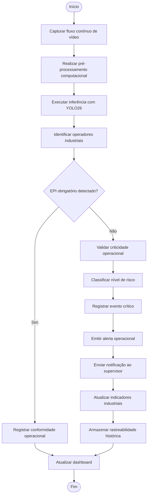

# Diagrama de Atividades

# Objetivo

O Diagrama de Atividades representa o fluxo operacional do SafeVision AI desde a captura do ambiente industrial até a geração de alertas e atualização dos indicadores operacionais.

A modelagem representa a principal funcionalidade crítica do sistema: monitoramento contínuo de EPIs e identificação de riscos operacionais.

---

# Fluxo Operacional Representado

O fluxo contempla:

- captura de vídeo industrial
- processamento computacional
- inferência com Inteligência Artificial
- validação operacional
- classificação de risco
- emissão de alertas
- rastreabilidade operacional

---

# Diagrama UML

---

# Interpretação do Fluxo

## Fluxo de Conformidade

Quando o operador utiliza corretamente os EPIs obrigatórios:

- o sistema registra conformidade
- os indicadores são atualizados
- o evento é consolidado historicamente

---

## Fluxo de Não Conformidade

Quando irregularidades são detectadas:

- o risco é classificado
- o evento é registrado
- alertas são emitidos
- supervisores são notificados
- o histórico operacional é atualizado