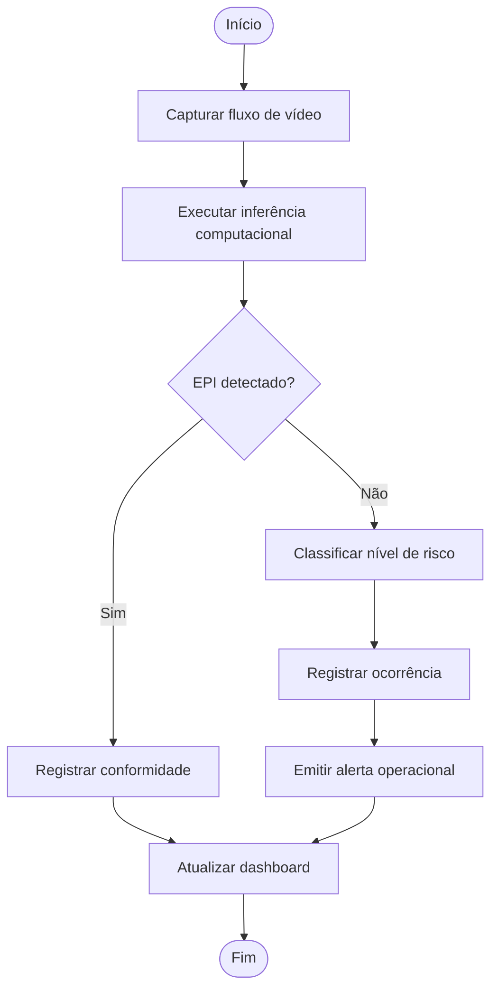

# Diagrama de Atividades

```mermaid
flowchart TD

A([Início])
B[Capturar fluxo de vídeo]
C[Executar inferência computacional]
D{EPI detectado?}

E[Registrar conformidade]
F[Atualizar dashboard]
G([Fim])

H[Classificar nível de risco]
I[Registrar ocorrência]
J[Emitir alerta operacional]

A --> B
B --> C
C --> D

D -- Sim --> E
E --> F
F --> G

D -- Não --> H
H --> I
I --> J
J --> F
```