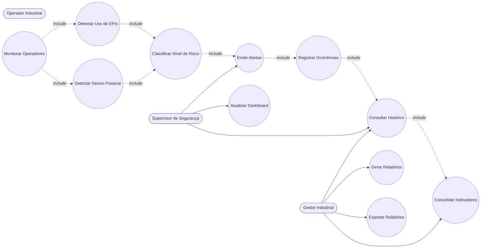

# Diagrama de Casos de Uso

# Objetivo

O Diagrama de Casos de Uso representa as principais interações entre os atores industriais e o sistema SafeVision AI.

A modelagem foi construída considerando o contexto operacional do Metaindústria, priorizando monitoramento contínuo, prevenção de acidentes e rastreabilidade operacional.

---

# Atores do Sistema

## Operador Industrial

Responsável pela execução das atividades operacionais monitoradas pelo sistema.

---

## Supervisor de Segurança

Responsável pelo acompanhamento operacional em tempo real, análise de ocorrências e resposta aos alertas críticos.

---

## Gestor Industrial

Responsável pela análise estratégica dos indicadores de segurança, conformidade e desempenho operacional.

---

# Diagrama UML

---

# Descrição dos Casos de Uso

| Caso de Uso | Descrição |
|---|---|
| Monitorar Operadores | Realiza monitoramento contínuo dos operadores industriais |
| Detectar Uso de EPIs | Identifica conformidade dos EPIs obrigatórios |
| Detectar Desvio Postural | Analisa postura e movimentação operacional |
| Classificar Nível de Risco | Determina criticidade da ocorrência |
| Emitir Alertas | Gera notificações operacionais em tempo real |
| Atualizar Dashboard | Atualiza indicadores operacionais |
| Registrar Ocorrências | Armazena eventos críticos |
| Consultar Histórico | Permite rastreamento operacional |
| Gerar Relatórios | Consolida relatórios analíticos |
| Exportar Relatórios | Exporta dados gerenciais |
| Consolidar Indicadores | Agrupa métricas operacionais |