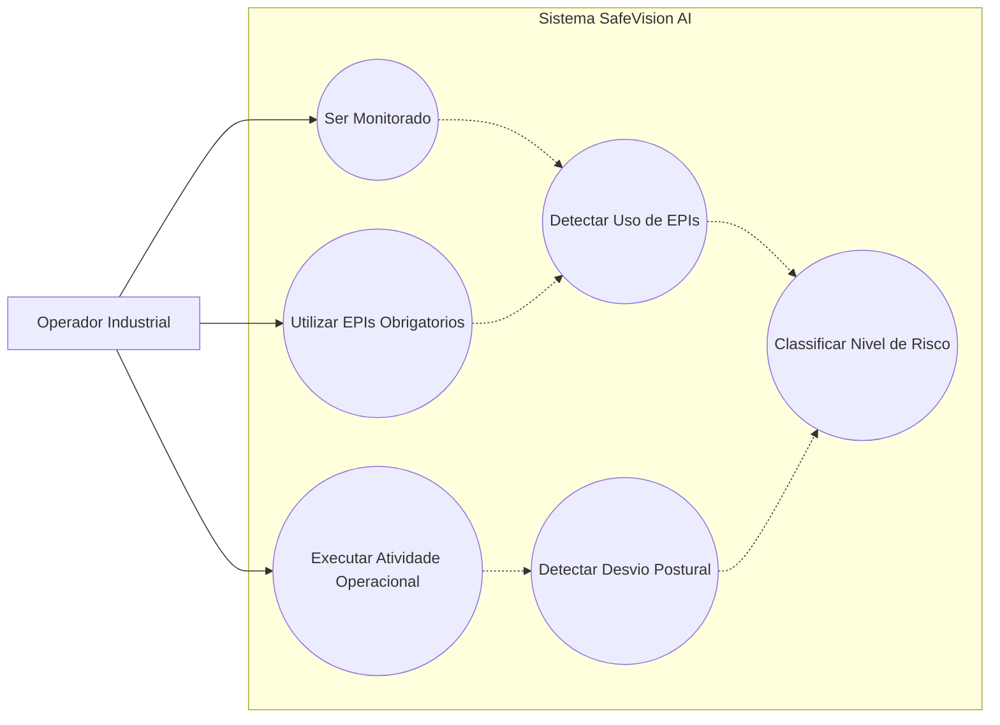
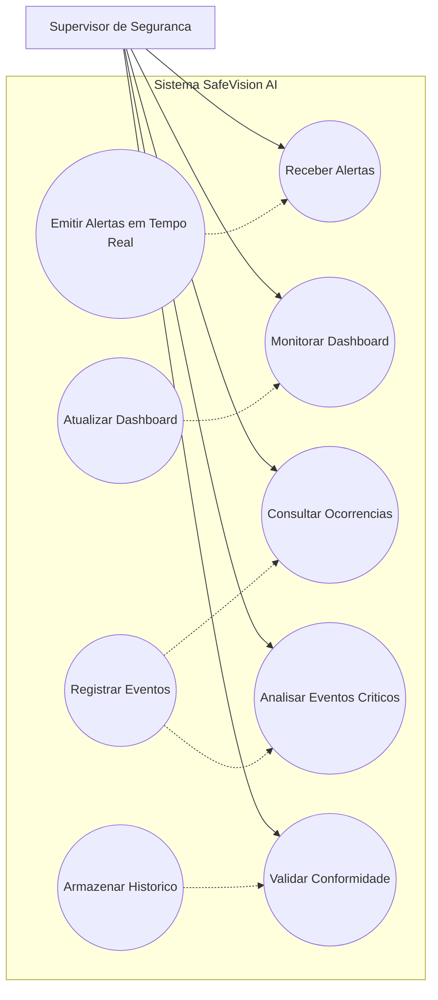
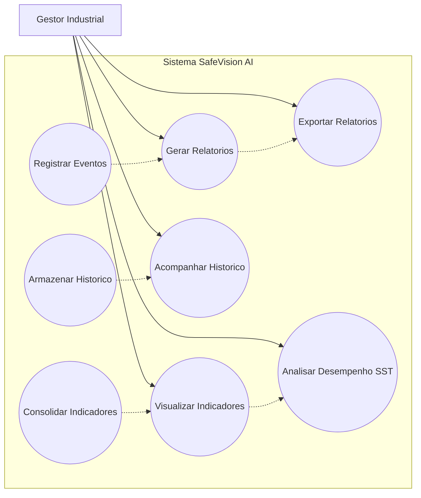

# Diagrama de Casos de Uso

# Objetivo

O Diagrama de Casos de Uso representa as interações específicas de cada perfil operacional com o sistema SafeVision AI dentro do contexto industrial do Metaindústria.

A modelagem foi segmentada por responsabilidade operacional, permitindo identificar claramente:

- ações do Operador Industrial
- responsabilidades do Supervisor de Segurança
- funcionalidades estratégicas do Gestor Industrial
- automações executadas pelo sistema

---

# Diagrama de Casos de Uso — Operador Industrial

---

# Diagrama de Casos de Uso — Supervisor de Segurança

---

# Diagrama de Casos de Uso — Gestor Industrial

---

# Casos de Uso por Ator

---

# Operador Industrial

| Caso de Uso | Objetivo |
|---|---|
| Ser Monitorado | Permitir acompanhamento contínuo das atividades operacionais |
| Utilizar EPIs Obrigatórios | Garantir conformidade de segurança |
| Executar Atividade Operacional | Realizar tarefas industriais monitoradas |

---

# Supervisor de Segurança

| Caso de Uso | Objetivo |
|---|---|
| Receber Alertas | Ser notificado sobre riscos operacionais |
| Monitorar Dashboard | Acompanhar eventos em tempo real |
| Consultar Ocorrências | Verificar eventos registrados |
| Analisar Eventos Críticos | Avaliar situações de risco |
| Validar Conformidade Operacional | Garantir cumprimento das normas de SST |

---

# Gestor Industrial

| Caso de Uso | Objetivo |
|---|---|
| Visualizar Indicadores | Acompanhar métricas estratégicas |
| Gerar Relatórios | Consolidar dados operacionais |
| Exportar Relatórios | Compartilhar informações gerenciais |
| Analisar Desempenho de SST | Avaliar indicadores de segurança |
| Acompanhar Histórico Industrial | Verificar evolução operacional |

---

# Processos Automatizados do Sistema

| Processo | Objetivo |
|---|---|
| Detectar Uso de EPIs | Identificar conformidade automaticamente |
| Detectar Desvio Postural | Identificar riscos ergonômicos |
| Classificar Nível de Risco | Determinar criticidade operacional |
| Registrar Eventos | Armazenar ocorrências |
| Atualizar Dashboard | Atualizar informações em tempo real |
| Armazenar Histórico | Garantir rastreabilidade |
| Emitir Alertas em Tempo Real | Reduzir tempo de resposta operacional |

---

# Benefícios da Modelagem

- separação clara de responsabilidades
- melhor rastreabilidade operacional
- alinhamento com contexto industrial real
- coerência entre requisitos e arquitetura
- aderência ao modelo de segurança proativa
- suporte à tomada de decisão estratégica