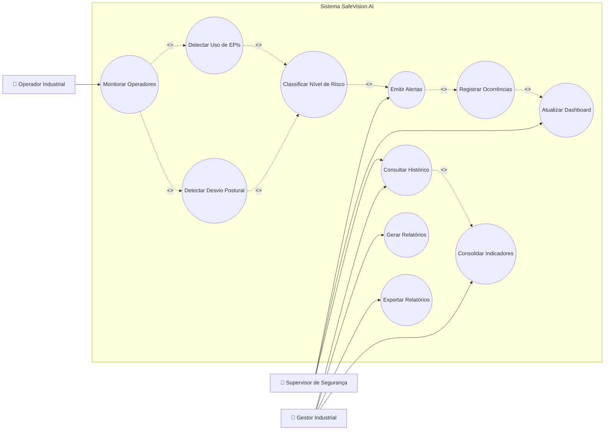

# Diagrama de Casos de Uso

# Objetivo

O Diagrama de Casos de Uso representa as interações entre os atores industriais e o sistema SafeVision AI dentro do contexto operacional do Metaindústria.

A modelagem foi desenvolvida com foco em:

- monitoramento contínuo
- segurança proativa
- rastreabilidade operacional
- prevenção de acidentes
- resposta em tempo real

O diagrama representa os principais fluxos de utilização da plataforma, evidenciando como supervisores, gestores e operadores interagem com os mecanismos inteligentes da solução.

---

# Atores do Sistema

## Operador Industrial

Profissional monitorado pelo sistema durante execução das atividades operacionais.

---

## Supervisor de Segurança

Responsável pelo acompanhamento operacional, resposta aos alertas e análise das ocorrências críticas.

---

## Gestor Industrial

Responsável pela análise estratégica dos indicadores industriais e tomada de decisão gerencial.

---

# Diagrama UML — Casos de Uso

---

# Descrição dos Casos de Uso

| Caso de Uso | Descrição |
|---|---|
| Monitorar Operadores | Realiza monitoramento contínuo do ambiente industrial |
| Detectar Uso de EPIs | Identifica conformidade dos EPIs obrigatórios |
| Detectar Desvio Postural | Analisa riscos ergonômicos e postura inadequada |
| Classificar Nível de Risco | Determina criticidade operacional da ocorrência |
| Emitir Alertas | Gera notificações em tempo real |
| Atualizar Dashboard | Atualiza indicadores operacionais instantaneamente |
| Registrar Ocorrências | Armazena eventos críticos detectados |
| Consultar Histórico | Permite rastreamento operacional histórico |
| Gerar Relatórios | Consolida dados analíticos industriais |
| Exportar Relatórios | Permite extração de relatórios gerenciais |
| Consolidar Indicadores | Agrupa métricas operacionais e estratégicas |

---

# Relacionamentos UML Utilizados

## <<include>>

Representa funcionalidades obrigatoriamente executadas dentro de outro caso de uso.

Exemplo:

- Detectar Uso de EPIs inclui Classificar Nível de Risco.

---

# Fluxo Geral Representado

1. O ambiente industrial é monitorado continuamente.
2. O sistema identifica EPIs e comportamento operacional.
3. O risco é classificado automaticamente.
4. Eventos críticos geram alertas operacionais.
5. As informações atualizam dashboards e históricos.
6. Gestores utilizam os dados para análise estratégica.