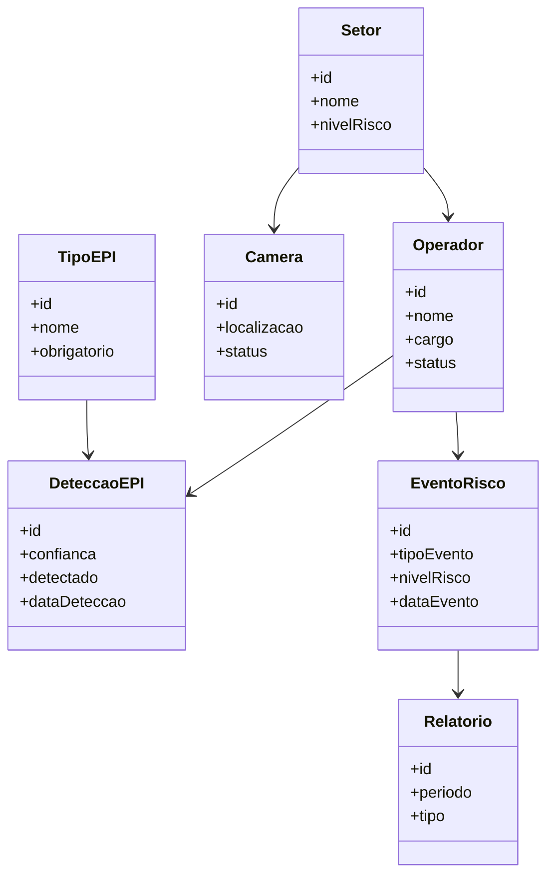

# Diagrama de Classes

```mermaid
classDiagram

class Operador {
  +id
  +nome
  +cargo
  +status
}

class Setor {
  +id
  +nome
  +nivelRisco
}

class Camera {
  +id
  +localizacao
  +status
}

class TipoEPI {
  +id
  +nome
  +obrigatorio
}

class DeteccaoEPI {
  +id
  +confianca
  +detectado
  +dataDeteccao
}

class EventoRisco {
  +id
  +tipoEvento
  +nivelRisco
  +dataEvento
}

class Relatorio {
  +id
  +periodo
  +tipo
}

Setor --> Operador
Setor --> Camera
Operador --> DeteccaoEPI
Operador --> EventoRisco
TipoEPI --> DeteccaoEPI
EventoRisco --> Relatorio
```