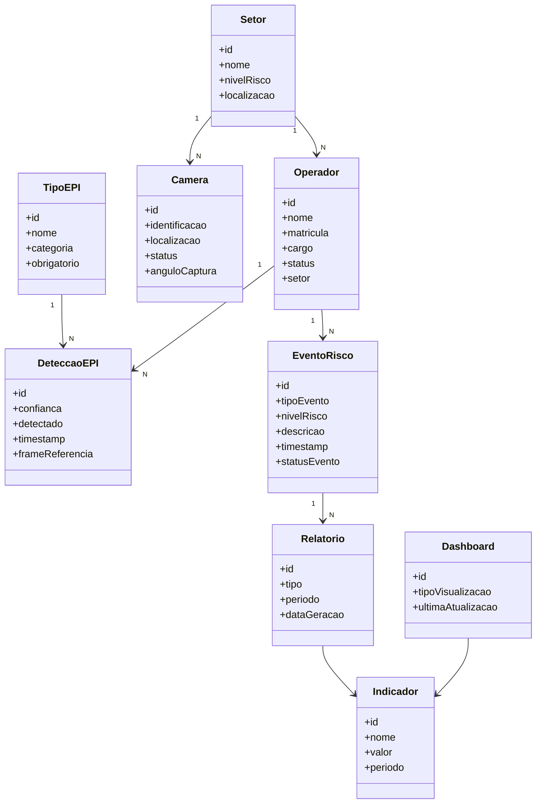

# Diagrama de Classes

# Objetivo

O Diagrama de Classes representa a estrutura lógica da solução SafeVision AI, modelando as principais entidades do domínio industrial e seus relacionamentos.

A modelagem foi construída considerando:

- rastreabilidade operacional
- monitoramento contínuo
- gestão de conformidade
- análise de risco
- geração de indicadores industriais

---

# Principais Entidades

## Operador

Representa os trabalhadores monitorados pela solução.

---

## Setor

Representa áreas operacionais da planta industrial.

---

## Camera

Representa os dispositivos responsáveis pela captura do fluxo de vídeo.

---

## TipoEPI

Representa os equipamentos de proteção monitorados.

---

## DeteccaoEPI

Representa as inferências computacionais realizadas pelo sistema.

---

## EventoRisco

Representa ocorrências críticas identificadas pela IA.

---

## Dashboard

Representa a visualização operacional em tempo real.

---

## Relatorio

Representa consolidações analíticas e gerenciais.

---

## Indicador

Representa métricas operacionais de conformidade e segurança.

---

# Diagrama UML

---

# Relacionamentos Principais

| Relacionamento | Descrição |
|---|---|
| Setor → Operador | Um setor possui múltiplos operadores |
| Setor → Camera | Um setor pode possuir múltiplas câmeras |
| Operador → DeteccaoEPI | Um operador pode gerar múltiplas detecções |
| Operador → EventoRisco | Um operador pode possuir múltiplos eventos |
| TipoEPI → DeteccaoEPI | Um EPI pode estar relacionado a diversas detecções |
| EventoRisco → Relatorio | Eventos compõem relatórios analíticos |