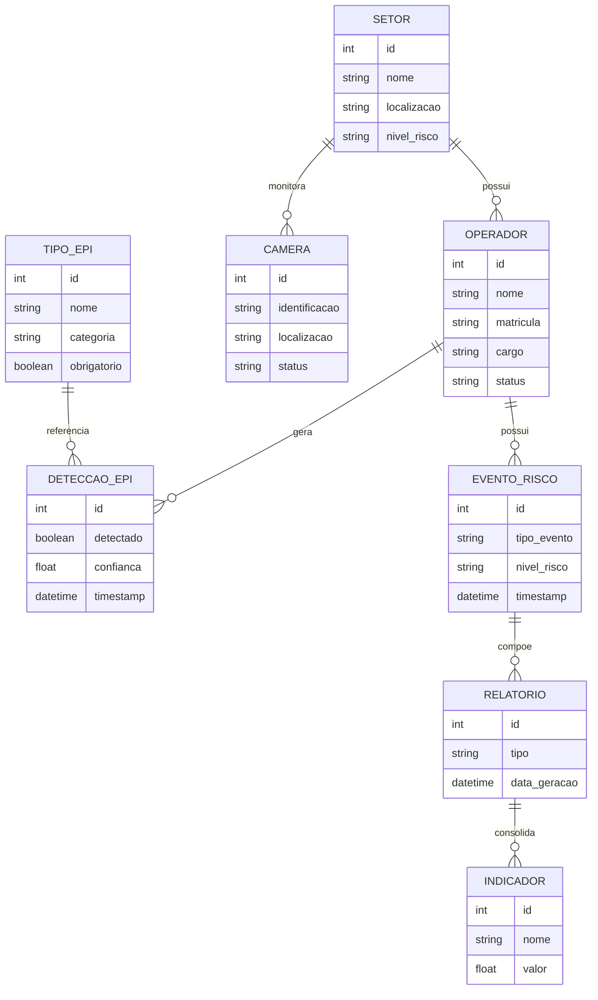

# Diagrama Entidade Relacionamento

# Objetivo

O Diagrama Entidade Relacionamento representa a estrutura lógica do banco de dados da solução SafeVision AI.

A modelagem foi projetada para garantir:

- rastreabilidade operacional
- integridade de dados
- armazenamento histórico
- suporte analítico
- consolidação de indicadores

---

# Diagrama ER

---

# Objetivos da Modelagem

- garantir rastreabilidade industrial
- consolidar eventos históricos
- suportar dashboards operacionais
- permitir geração de relatórios
- armazenar conformidade operacional
- apoiar análise estratégica